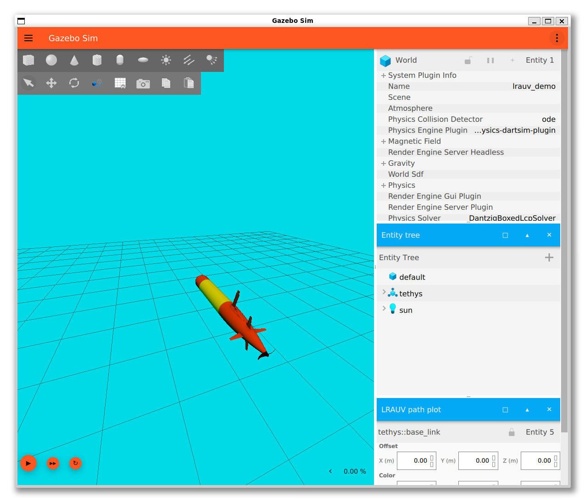
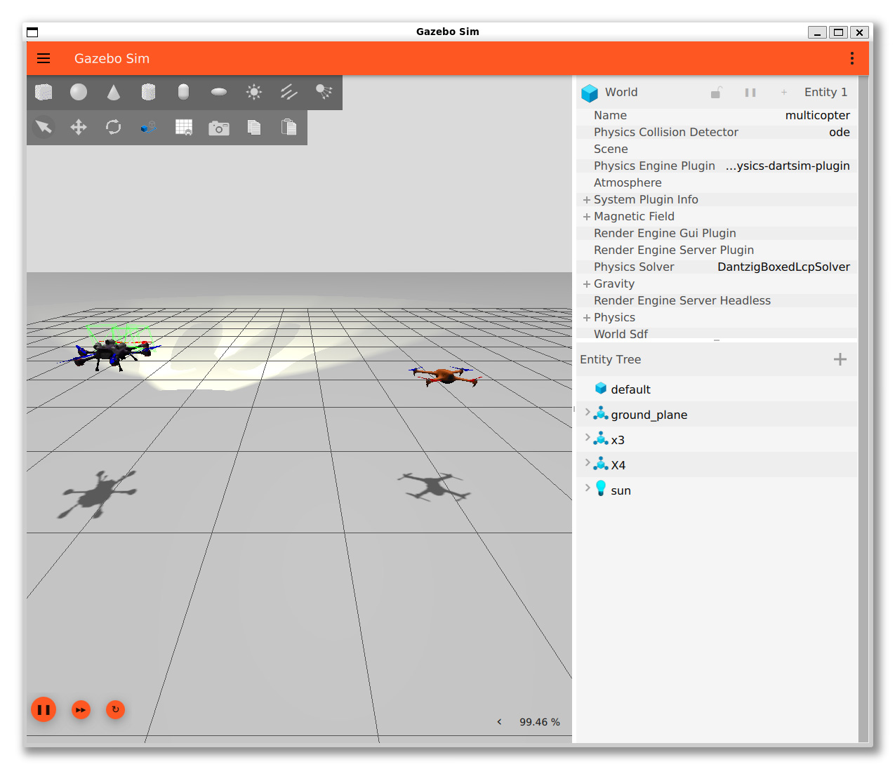

# Gazebo Experience

Gazebo Sim (gz-sim) 学习与实践项目，包含完整的示例代码、场景文件和编译脚本。

## 预览

### 水下机器人 LRAUV 控制演示


### 多旋翼飞行器速度控制


---

## 项目结构

```
gazebo-experience/
├── gz-sim/                    # Gazebo Sim 源码（submodule）
│   └── examples/
│       ├── standalone/        # 15 个独立示例程序
│       └── worlds/            # 丰富的仿真场景集合
├── build-standalone.sh        # 一键编译所有 standalone 示例
├── standalone.md              # Standalone 示例详细文档
└── worlds.md                  # World 场景详细文档
```

---

## 安装 Gazebo

### Ubuntu 系统安装 Gazebo Jetty

```bash
# 安装必要工具
sudo apt-get update
sudo apt-get install curl lsb-release gnupg

# 添加 Gazebo 官方源
sudo curl https://packages.osrfoundation.org/gazebo.gpg --output /usr/share/keyrings/pkgs-osrf-archive-keyring.gpg
echo "deb [arch=$(dpkg --print-architecture) signed-by=/usr/share/keyrings/pkgs-osrf-archive-keyring.gpg] https://packages.osrfoundation.org/gazebo/ubuntu-stable $(lsb_release -cs) main" | sudo tee /etc/apt/sources.list.d/gazebo-stable.list > /dev/null
echo "deb [arch=$(dpkg --print-architecture) signed-by=/usr/share/keyrings/pkgs-osrf-archive-keyring.gpg] https://packages.osrfoundation.org/gazebo/ubuntu-prerelease $(lsb_release -cs) main" | sudo tee /etc/apt/sources.list.d/gazebo-prerelease.list > /dev/null

# 安装 Gazebo Jetty
sudo apt-get update
sudo apt-get install gz-jetty
```

### 验证安装

```bash
gz sim --version
```

---

## 快速开始

### 1. 克隆项目

```bash
git clone git@github.com:vitorcen/gazebo-experience.git
cd gazebo-experience
```

### 2. 初始化 Submodule

```bash
git submodule update --init --recursive
```

### 3. 编译 Standalone 示例

一键编译所有 15 个示例项目：

```bash
./build-standalone.sh
```

编译成功后，所有可执行文件位于：
```
gz-sim/examples/standalone/<项目名>/build/
```

### 4. 运行示例

**键盘控制车辆**：
```bash
# 终端 1 - 启动仿真
gz sim -v 4 gz-sim/examples/worlds/diff_drive.sdf

# 终端 2 - 运行键盘控制
cd gz-sim/examples/standalone/keyboard/build
./keyboard ../keyboard.sdf
```

**水下机器人控制**：
```bash
# 终端 1 - 启动仿真
gz sim -r gz-sim/examples/worlds/lrauv_control_demo.sdf

# 终端 2 - 运行 PID 控制器
cd gz-sim/examples/standalone/lrauv_control/build
./lrauv_control 0.5 0.174 0.174
```

> 💡 效果预览见上方 [预览](#预览) 部分

**多旋翼速度控制**：
```bash
# 启动仿真（包含速度控制功能）
gz sim -r gz-sim/examples/worlds/multicopter_velocity_control.sdf

# 控制命令（在新终端中）
# X3 上升
gz topic -t "/X3/gazebo/command/twist" -m gz.msgs.Twist -p "linear: {x: 0, y: 0, z: 0.1}, angular: {z: 0}"

# X3 悬停
gz topic -t "/X3/gazebo/command/twist" -m gz.msgs.Twist -p "linear: {x: 0, y: 0, z: 0}, angular: {z: 0}"
```

> 💡 效果预览见上方 [预览](#预览) 部分

---

## 详细文档

### 📘 [Standalone Examples（standalone.md）](./standalone.md)

15 个独立示例程序的完整指南：
- 键盘控制（keyboard）
- 水下机器人控制（lrauv_control）
- 声学通信演示（acoustic_comms_demo）
- 多机器人竞赛（multi_lrauv_race）
- 动态实体创建（entity_creation）
- 可视化标记（marker）
- 外部 ECM 访问（external_ecm）
- 灯光控制（light_control）
- 自定义服务器（custom_server）
- 性能测试（each_performance）
- 手柄控制（joystick + joy_to_twist）
- 单元测试（gtest_setup）
- 场景请求（scene_requester）
- 通信发布器（comms）

### 🌍 [World Scenes（worlds.md）](./worlds.md)

丰富的仿真场景集合，包含：
- 基础场景（empty, shapes, sensors）
- 车辆控制（diff_drive, mecanum_drive, ackermann_steering）
- 飞行器（quadcopter, plane）
- 水下机器人（LRAUV, AUV）
- 传感器（camera, lidar, depth_camera, thermal_camera）
- 物理效果（buoyancy, lift_drag, wind）
- 通信（acoustic_comms, rf_comms）
- Actor 与人群（actor_crowd）
- 地形（heightmap, dem_moon）
- 可视化调试（visualize_contacts, debug_shapes）

---

## 常用命令

### 查看话题列表
```bash
gz topic -l
```

### 监听话题
```bash
gz topic -e -t /话题名称
```

### 发布消息
```bash
gz topic -t /话题名称 --msgtype 消息类型 -p '载荷'
```

### 调用服务
```bash
gz service -s /服务名称 --reqtype 类型 --reptype 类型 --timeout 超时 -r '数据'
```

---

## 故障排查

### 库版本冲突（conda 环境）

如果编译时出现 fmt/spdlog 版本冲突：

编译脚本已自动处理，使用纯净系统 PATH：
```bash
export PATH=/usr/local/sbin:/usr/local/bin:/usr/sbin:/usr/bin:/sbin:/bin
```

### Submodule 未初始化

如果运行 `build-standalone.sh` 提示找不到目录：
```bash
git submodule update --init --recursive
```

### 清理重新编译

```bash
cd gz-sim/examples/standalone
find . -type d -name "build" -exec rm -rf {} +
cd ../../..
./build-standalone.sh
```

---

## 系统要求

- Ubuntu 24.04 或兼容系统
- Gazebo Jetty (gz-jetty)
- CMake 3.10+
- C++ 编译器（支持 C++17）
- 系统库：
  - libfmt9
  - libspdlog1.12
  - gz-transport
  - sdformat
  - gz-msgs
  - gz-common

---

## 快速参考

| 需求 | 资源 |
|------|------|
| 学习键盘控制 | [standalone.md - keyboard](./standalone.md#1-keyboard---键盘控制车辆) |
| 水下机器人 | [standalone.md - lrauv_control](./standalone.md#2-lrauv_control---水下机器人控制) |
| 传感器仿真 | [worlds.md - 摄像机与传感器](./worlds.md#摄像机与传感器) |
| 车辆控制 | [worlds.md - 车辆与移动](./worlds.md#车辆与移动) |
| 飞行器仿真 | [worlds.md - 飞行器](./worlds.md#飞行器) |
| 通信系统 | [worlds.md - 通信](./worlds.md#通信) |

---

## 贡献

欢迎提交 Issue 和 Pull Request！

## 许可证

本项目遵循 gz-sim 的许可证（Apache 2.0）。

---

**Happy Simulating! 🚀**
